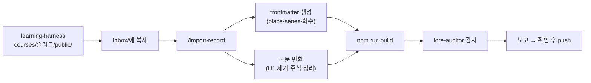

# 🛠 블로그 하네스 가이드 — Claude Code로 운영하는 법

> 이 블로그를 **Claude Code와 함께 운영하기 위한 자동화 체계(하네스)**의 구조·사용법·확장법.
> 글쓰기 규칙 자체는 [HANDBOOK.md](../HANDBOOK.md), 세계관·디자인 규칙은 [WORLDBOOK.md](../WORLDBOOK.md)가 원본이고,
> 이 문서는 "그 규칙들을 Claude가 자동으로 지키게 만드는 장치"를 설명한다.

---

## 1. 하네스란 무엇이고, 왜 이렇게 생겼나

이 저장소에서 Claude Code를 열면, Claude는 아래 파일들을 통해 **이 블로그의 규칙을 아는 상태**로 시작한다:

```
blog/
├─ CLAUDE.md                        ← ① 프로젝트 헌법 — 세션마다 자동 로드
├─ .claude/
│  ├─ skills/                      ← ② 스킬 4종 — /이름 으로 호출하는 작업 절차서
│  │  ├─ import-record/SKILL.md    │    외부 원고 → 블로그 기록 변환 (핵심)
│  │  ├─ new-record/SKILL.md       │    새 기록·일지 스캐폴딩
│  │  ├─ design-work/SKILL.md      │    디자인·기능 변경 절차 + 확정 정책
│  │  └─ release-check/SKILL.md    │    발행 전 최종 점검
│  ├─ agents/
│  │  └─ lore-auditor.md           ← ③ 세계관 감사 서브에이전트
│  └─ settings.local.json          ← 개인 권한 설정 (git 제외)
└─ inbox/                          ← ④ 외부 원고 투입함 (git 제외, README만 추적)
```

설계 원칙 세 가지:

1. **규칙의 원본은 문서, 하네스는 포인터.** 스킬은 WORLDBOOK·HANDBOOK을 다시 베끼지 않고
   해당 절(§)을 가리킨다. 규칙이 바뀌면 문서 한 곳만 고치면 된다.
2. **변환은 블로그가 소유한다.** 학습 원고를 만드는 하네스(learning-harness-fable)는
   블로그 스키마를 전혀 모른다. 스키마·문법·세계관 규칙은 전부 이 저장소의 지식이므로,
   "원고 → 기록" 변환도 이 저장소의 스킬이 담당한다. 블로그가 바뀌어도 고칠 곳은 여기 하나다.
3. **MCP 서버는 없다.** 외부 서비스 연동이 없어서 스킬+에이전트로 충분하다.
   필요해지는 시점(예: 발행 알림, 외부 CMS)이 오면 그때 추가한다.

## 2. 구성 요소 상세

### ① `CLAUDE.md` — 프로젝트 헌법

모든 세션에 자동 주입된다. 담는 것: 문서 지도, 절대 규칙 6가지(세계관 용어는 UI에만,
방랑자=손님, 본문 판타지화 금지, WORLDBOOK 우선, 슬러그 전역 유일, 영어 커밋),
빌드 명령, 콘텐츠 구조 요약, 스킬 목록. **여기에 긴 설명을 넣지 않는다** — 헌법은 짧아야
매 세션의 컨텍스트를 아끼고, 자세한 건 이 가이드와 HANDBOOK이 담당한다.

### ② 스킬 — `/이름`으로 호출하는 절차서

| 스킬 | 하는 일 | 언제 |
|---|---|---|
| `/import-record` | 외부 순수 .md → frontmatter 생성 → 본문 변환 → 빌드·감사 | inbox/에 원고를 넣었을 때 |
| `/new-record` | 기록·일지를 올바른 frontmatter로 스캐폴딩 | 블로그에서 직접 새 글을 시작할 때 |
| `/design-work` | 변경 절차(WORLDBOOK 먼저), 확정 취향·모바일 정책, 스크린샷 QA 패턴 | 화면에 보이는 무언가를 바꾸기 전 |
| `/release-check` | 빌드·frontmatter·세계관·렌더 점검 | 커밋/push 직전 |

스킬은 명시적으로 호출하지 않아도 된다 — 설명(description)에 트리거 조건이 적혀 있어서
"이 원고 가져와줘"라고만 해도 Claude가 알아서 로드한다.

### ③ `lore-auditor` — 세계관 감사 에이전트

읽기 전용(Read/Grep/Glob) 서브에이전트. 검사 항목:

- **WORLDBOOK §1.2 절대 규칙**: 세계관 용어(교차로·방랑자·기록·연대기·서고·전서구 등)가
  frontmatter title/description/tags, 슬러그, aria-label, OG에 새어 나왔는지
- **방랑자=손님 규칙**: "여관 주인" 표현, 방랑자를 쉼터의 소유자로 지칭하는 문장
- **UI 카피가 copy-deck.md와 일치**하는지
- **본문이 판타지 문체로 쓰였는지** (도입·맺음 한 줄 양념은 허용)

import-record와 release-check가 마지막 단계에서 자동 호출한다. 수정은 하지 않고 보고만 한다.

### ④ `inbox/` — 원고 투입함

외부에서 쓴 `.md`를 던져 넣는 곳. `.gitignore`가 `inbox/*`를 제외하므로(README만 추적)
초안이 공개 저장소에 올라갈 걱정이 없다. 변환이 끝난 원고는 지운다 — 정본은 원 하네스에 있다.

## 3. 핵심 워크플로우: 학습 연대기 가져오기

learning-harness-fable(`D:\Coding\learning-harness-fable`)에서 쓴 학습 챕터를
블로그 연대기로 만드는 전체 흐름:



### 기계적 변환은 스크립트가 고정한다

`scripts/import-chapter.mjs`가 H1 제거·주석 제거·링크 해제·hr 정리·frontmatter 골격 생성을
**결정론적으로** 수행한다 (`node scripts/import-chapter.mjs <원고> --series <슬러그> --out <목적지>`).
모델은 TODO 필드(description·place·tags·제목 접두)와 검증만 담당한다 — 어떤 모델이
와도 변환 품질이 흔들리지 않게 하는 장치다. 스크립트와 스킬 §5의 규칙은 항상 함께 고친다.

### 원고 쪽 규약 (learning-harness 산출물의 형태)

- **`courses/<slug>/public/`의 공개 사본을 쓴다.** `chapters/` 원본은 LO-MAP 주석,
  shared_context 참조 같은 하네스 내부 장치를 포함한다 (public이 없으면 원본을 쓰되 스킬이 제거).
- 파일명 `Ch{NN}_{제목}.md`, frontmatter 없음, `# Chapter N: 제목` H1으로 시작.
- 다이어그램은 mermaid 코드펜스 — 블로그가 그대로 렌더한다 (HANDBOOK §4.6).

### 블로그 쪽 매핑 (스킬이 자동 적용)

| 원고 | → 블로그 |
|---|---|
| 코스 슬러그 (`apache-spark`) | `series: apache-spark` — 과목 하나 = 연대기 하나 |
| 챕터 번호 N | `seriesOrder: N`, 파일명 `{series}-ch{NN}.md` |
| H1 `# Chapter N: 제목` | frontmatter `title`(번호 없이) + H1 삭제 |
| 과목 주제 | `place` (IT→길드, 수학→탑, 과학→연구실, AI→거울, 역사→기록관, 독서→도서관) |
| 커리큘럼 완결 | 마지막 화에 `seriesStatus: completed` |

결과: 장소 페이지의 "연대기 서가"에 시리즈로 묶여 노출되고, `/chronicles/{series}/`에
목차가 생기고, 각 화에 이전/다음 내비게이션이 붙는다. **단발 글(이야기 글)은 series 없이
발행**하면 같은 장소의 개별 기록으로 나뉘어 보인다 — 말머리 대신 태그로 묶는다.

## 4. Mermaid 다이어그램 파이프라인 (2026-07-12 추가)

학습 원고가 다이어그램을 전부 mermaid로 그리기 때문에 붙인 기능. 동작 구조:

1. **빌드 시** — `src/lib/remark-mermaid.ts`가 ` ```mermaid ` 펜스를 Shiki 하이라이팅 대신
   `<div class="mermaid-figure"><pre class="mermaid-src">원본</pre></div>`으로 바꾼다.
2. **로드 시** — `src/layouts/Base.astro`의 로더가 페이지에 `.mermaid-figure`가 **있을 때만**
   `src/scripts/mermaid-client.ts`를 동적 import한다. 다이어그램 없는 페이지는 mermaid를
   1바이트도 내려받지 않는다. 라이브러리는 npm 번들(외부 CDN 없음 — 폰트와 같은 정책).
3. **렌더 시** — 디자인 토큰(`--card`·`--ink`·`--gold-dim`·`--muted` 등)을 읽어
   mermaid `base` 테마에 입힌다. 낮↔밤 전환(`theme-changed` 이벤트) 시 자동 재렌더.
4. **폴백** — JS가 없거나 mermaid 문법 오류면 원본 소스가 코드처럼 보인다 (조용한 실패 없음).

스타일 박스는 `global.css`의 `.mermaid-figure` (코드 블록과 같은 필사 노트 톤, 각진 판형).

## 4.5 표기의 경계선 — 무엇을 소스에서 통일하고 무엇을 여기서 변환하나

기준: **"블로그 밖(GitHub·에디터)에서도 의미 있는 표기인가?"**

| 표기 | 소유 | 규칙 |
|---|---|---|
| 수식 `$...$`/`$$...$$` | **소스 하네스** (표준 LaTeX로 통일) | 무변환 — 변환은 조용한 오류를 만든다 |
| 정리/증명 | 소스는 blockquote 마커 (`> **정리 N.M**: …`) | import가 `:::theorem` 등으로 기계 변환 |
| `:::` 디렉티브·✦·드롭캡 | **블로그 전용** | 소스에서 쓰지 않는다 (GitHub에서 깨짐) |
| Mermaid 코드펜스 | 표준 (GitHub도 렌더) | 무변환 |

## 5. 콘텐츠 정책 요약 (2026-07-12 확정)

- **학습 글** (과목별 Ch01~N): 과목 하나 = 연대기 하나. 제목에 화수 불필요 (seriesOrder가 표현).
- **단발 이야기 글** ("가우스의 일화", "번개는 왜 치는가"): series 없이 발행, 공통 태그로 묶음.
  대괄호 말머리는 쓰지 않는다 (`<title>`·OG에 노이즈).
- **본문 문체**: 일반 기술/일반 블로그 문체. 판타지화하지 않는다 —
  도입·맺음 한 줄 수준의 세계관 양념만 선택 허용. 세계관은 프레임(UI)의 몫.

## 6. 하네스를 고치고 확장하는 법

- **규칙이 바뀌면**: WORLDBOOK/HANDBOOK부터 고치고, 스킬에는 바뀐 절 번호만 반영한다.
  스킬 본문에 규칙 원문을 복붙하지 말 것 (이중 원본이 되어 어긋난다).
- **새 스킬 추가**: `.claude/skills/<이름>/SKILL.md` 생성 — frontmatter에 `name`과
  `description`(트리거 조건 포함)을 쓰고, 본문은 절차를 담는다. `CLAUDE.md`의 하네스
  목록과 이 가이드 §2 표에 한 줄 추가.
- **새 에이전트 추가**: `.claude/agents/<이름>.md` — frontmatter에 `name`/`description`/`tools`
  (필요 최소 도구만). 감사·검증처럼 "읽고 보고만 하는" 역할에 적합하다.
- **스킬 없이 그냥 시켜도 된다**: 하네스는 반복 작업의 품질을 고정하는 장치지 관문이 아니다.
  일회성 작업은 평소처럼 대화로 진행하면 된다.

## 7. 트러블슈팅

| 증상 | 원인·해법 |
|---|---|
| import한 글이 빌드에서 스키마 오류 | frontmatter 필수 필드(description·place·date) 누락 — `src/content.config.ts`가 기준 |
| authors-den 글이 빌드 실패 | 집필실 글은 `series` 필수 (스키마 refine 규칙) |
| 다이어그램 자리에 소스 코드가 보임 | mermaid 문법 오류(폴백 동작) — 소스를 mermaid.live 등에서 검증 후 수정 |
| 새 글이 사이트에 안 보임 | `draft: true` 상태 — 발행 시 false로 |
| 슬러그 충돌 | 파일명이 전역 유일해야 함 — `src/content/records/**/*.md`에서 중복 확인 |
| 배포가 안 됨 | `gh run list --limit 1`로 Actions 확인 — Node 22, main push 트리거 |
| 코스 전량 발행 시 서고·RSS 도배 | `date`를 화수 순서대로 과거 날짜로 분산하거나 몇 화씩 단계 발행 (스킬 §6) |

---

*하네스가 길을 잃으면 이 가이드로, 글쓰기 규칙은 HANDBOOK으로, 세계의 이치는 WORLDBOOK으로.* ✦
